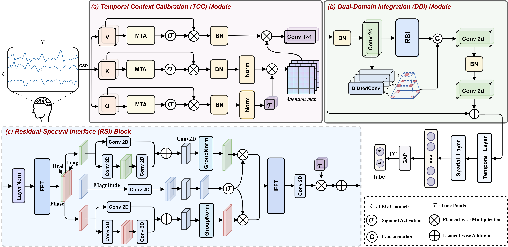

# PCRNet

# Code for paper: PCRNet: Phase-aware Complex Reffnement Network for EEG-based Auditory Attention Decoding
This paper proposes a Phase-aware Complex Refinement Network (PCRNet) for AAD, which consists of a Temporal Context Calibration (TCC) module and a Dual-Domain Integration (DDI) module. Specifically, the TCC module captures long-range temporal dependencies through multi-scale temporal attention mechanism, while the DDI module employs a phase-guided spectral filtering strategy to dynamically suppress noise-dominated frequencies and refine the real and imaginary components separately. This design enables effective phase recalibration and enhances the discriminability of target features in the complex domain. Experimental results on three public datasets demonstrate that PCRNet outperforms state-of-the-art methods, particularly under challenging ultra-short 0.1-second windows.

Xiran Chen, Xiaoke Yang, Jian Zhou, Zhao Lv, Cunhang Fan. PCRNet: Phase-aware Complex Reffnement Network for EEG-based Auditory Attention Decoding. In ICML 2026.

# Preprocess
* Please download the AAD dataset for training.
* The public [KUL dataset](https://zenodo.org/records/4004271), [DTU dataset](https://zenodo.org/record/1199011#.Yx6eHKRBxPa) and [AVED dataset](https://iiphci.ahu.edu.cn/toAuditoryAttention) are used in this paper.

# Requirements
+ Python3.12 \
`pip install -r requirements.txt`

# Run
* Modifying the Run Settings in `config.py`
* Using main.py to train and test the model
